# EDA — VN-AV-DF Dataset (real clips)

## 1. Tổng quan

| Chỉ số | Giá trị |
|---|---|
| Tổng clip (scored) | 6888 |
| Số video gốc | 246 |
| Clip có mặt | 6872 (99.8%) |
| Clip không mặt | 16 (0.2%) |
| Có cut-metadata | 6888 |
| Clip sau curate (tập sạch) | 3001 |
| Số speaker (tập sạch) | 674 |

## 2. Phân bố theo tier

| Tier | Scored | Tập sạch |
|---|---|---|
| tier1 | 4776 | 1812 |
| tier2 | 1011 | 681 |
| tier3 | 1101 | 508 |

## 3. Phân bố đặc trưng (toàn bộ scored)

| Đặc trưng | n | mean | std | min | p10 | median | p90 | max |
|---|---|---|---|---|---|---|---|---|
| Thời lượng (s) | 6888 | 4.35 | 1.93 | 2.01 | 2.30 | 4.09 | 6.78 | 12.00 |
| SNR (dB) | 6888 | 9.76 | 8.75 | -16.54 | 1.54 | 7.27 | 20.39 | 40.27 |
| face_ratio (cut) | 6888 | 0.994 | 0.035 | 0.700 | 1.000 | 1.000 | 1.000 | 1.000 |
| speech_ratio (cut) | 6888 | 1.000 | 0.000 | 1.000 | 1.000 | 1.000 | 1.000 | 1.000 |
| det_ratio (đo) | 6888 | 0.991 | 0.067 | 0.000 | 1.000 | 1.000 | 1.000 | 1.000 |
| mean_face_area | 6888 | 0.0427 | 0.0490 | 0.0000 | 0.0053 | 0.0319 | 0.0828 | 0.4922 |
| embed_consistency | 6888 | 0.785 | 0.193 | 0.000 | 0.452 | 0.857 | 0.954 | 1.000 |

## 4. Định danh speaker (tập sạch)

| Chỉ số | Giá trị |
|---|---|
| Số speaker | 674 |
| Clip/speaker (min/median/max) | 1 / 2 / 30 |
| Speaker chỉ 1 clip | 310 |

> `speaker_id` dùng để chia train/val/test theo **speaker-disjoint**, chống identity leakage ở bước modeling.

## 5. Biểu đồ

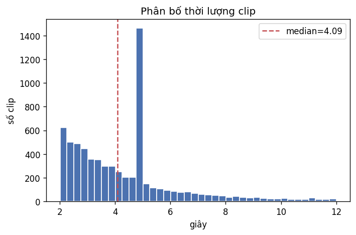
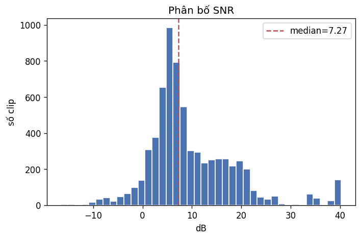
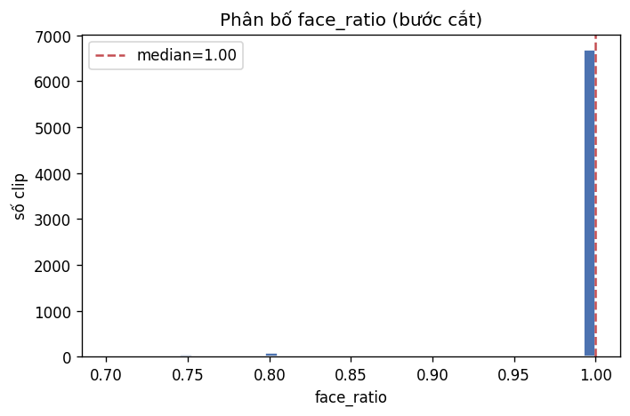
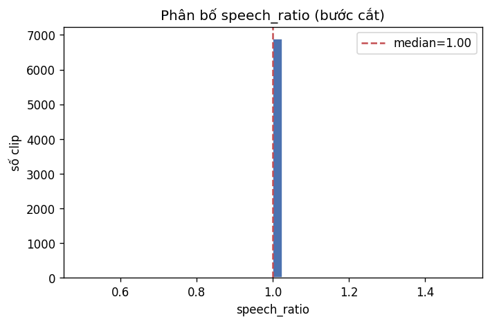
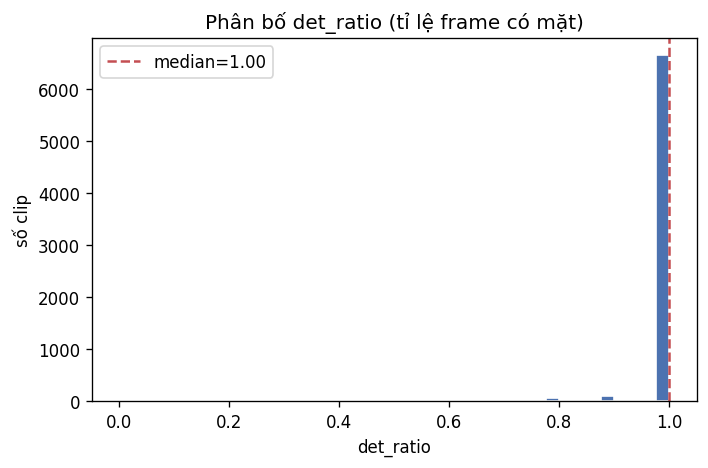
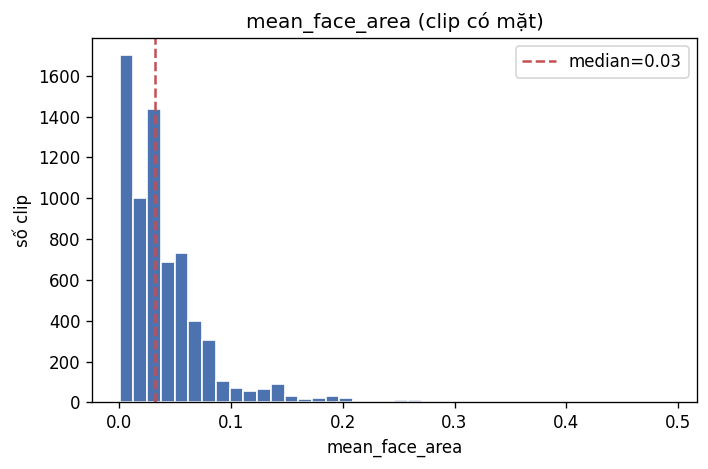
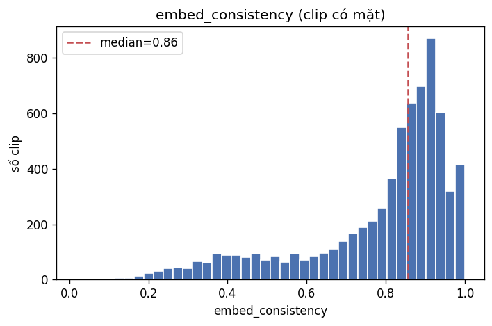
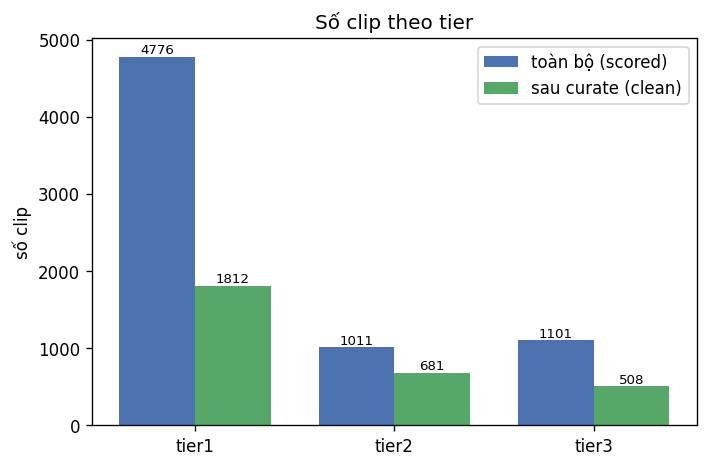
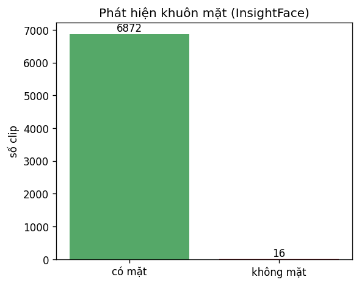
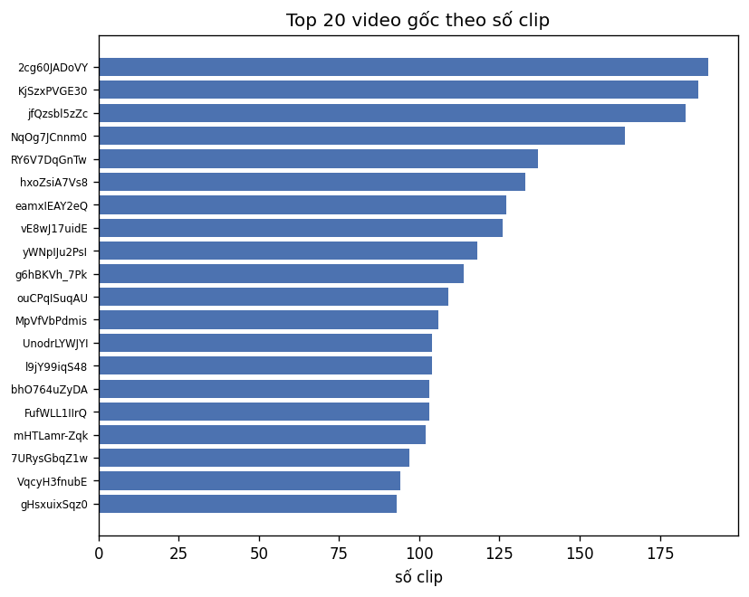
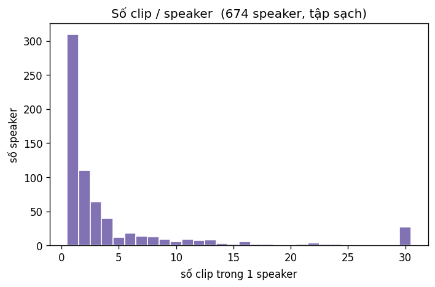
